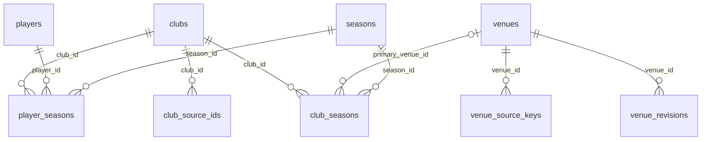
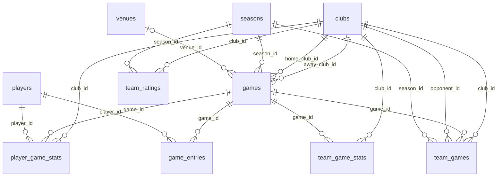
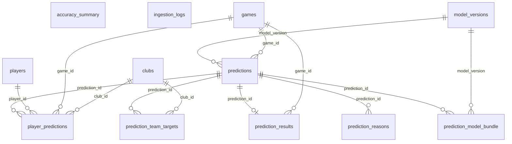

# B.PREDICT データベース現状

| 項目 | 内容 |
|---|---|
| 生成 | **`python3 scripts/describe_schema.py` が生成する。手で編集しない** |
| 生成日 | 2026-10-01 |
| 構造の出典 | `db/migrations/*.sql`（列の説明は DDL のコメント） |
| 行数の出典 | D1 の本番データ（2026-10-01 の `wrangler d1 export`） |
| 定義と設計の理由 | **`docs/design-detail.md` 1章**。この文書では繰り返さない |

この文書は「**いま実際に何が入っているか**」だけを扱う。列の意味・制約の理由・
トリガの設計意図は詳細設計1章にあり、ここに二重に書かない。

## 表の一覧

| 表 | 分類 | 列数 | 行数 | 索引 | トリガ |
|---|---|---:|---:|---:|---:|
| [`accuracy_summary`](#accuracy_summary) | 評価 | 9 | 0 | 0 | 0 |
| [`club_seasons`](#club_seasons) | マスタ | 8 | 238 | 1 | 0 |
| [`club_source_ids`](#club_source_ids) | マスタ | 5 | 30 | 1 | 0 |
| [`clubs`](#clubs) | マスタ | 5 | 30 | 0 | 0 |
| [`game_entries`](#game_entries) | ファクト | 6 | 0 | 0 | 0 |
| [`games`](#games) | ファクト | 25 | 6,270 | 4 | 0 |
| [`ingestion_logs`](#ingestion_logs) | 運用 | 9 | 25 | 1 | 0 |
| [`model_versions`](#model_versions) | 評価（モデル） | 25 | 0 | 1 | 1 |
| [`player_game_stats`](#player_game_stats) | ファクト | 24 | 146,463 | 1 | 0 |
| [`player_predictions`](#player_predictions) | 予測 | 31 | 0 | 1 | 4 |
| [`player_seasons`](#player_seasons) | マスタ | 8 | 0 | 1 | 0 |
| [`players`](#players) | マスタ | 5 | 1,024 | 0 | 0 |
| [`prediction_model_bundle`](#prediction_model_bundle) | 予測 | 4 | 0 | 0 | 2 |
| [`prediction_reasons`](#prediction_reasons) | 予測 | 8 | 0 | 0 | 2 |
| [`prediction_results`](#prediction_results) | 評価 | 14 | 0 | 2 | 0 |
| [`prediction_team_targets`](#prediction_team_targets) | 予測 | 17 | 0 | 0 | 2 |
| [`predictions`](#predictions) | 予測 | 19 | 0 | 3 | 2 |
| [`seasons`](#seasons) | マスタ | 5 | 11 | 0 | 0 |
| [`team_game_stats`](#team_game_stats) | ファクト | 22 | 12,540 | 1 | 0 |
| [`team_games`](#team_games) | ファクト | 10 | 12,540 | 1 | 0 |
| [`team_ratings`](#team_ratings) | 派生 | 8 | 0 | 0 | 0 |
| [`venue_revisions`](#venue_revisions) | マスタ | 5 | 0 | 0 | 0 |
| [`venue_source_keys`](#venue_source_keys) | マスタ | 2 | 149 | 0 | 0 |
| [`venues`](#venues) | マスタ | 7 | 149 | 0 | 0 |

**12 表にデータがあり、12 表が空である。**

### 空の表とその理由

| 表 | 理由 |
|---|---|
| `accuracy_summary` | `prediction_results` を畳んだ表。照合が始まってから（工程9b 以降） |
| `game_entries` | 取得するのは `gameday_update` で、まだ実装されていない（詳細設計 4.1） |
| `model_versions` | 学習済みモデルの登録は工程8 |
| `player_predictions` | 親の `predictions` が空（工程9b） |
| `player_seasons` | 登録区分とポジションの正規化が未決のため backfill が作らない（詳細設計 3.4） |
| `prediction_model_bundle` | 親の `predictions` が空（工程9b） |
| `prediction_reasons` | 親の `predictions` が空（工程9b） |
| `prediction_results` | 照合は予測が入ってから（工程9b 以降） |
| `prediction_team_targets` | 親の `predictions` が空（工程9b） |
| `predictions` | 推論の結線は工程9b（詳細設計 9章） |
| `team_ratings` | **スナップショット側には 12,532 行ある。** D1 への書き戻しが未実施（詳細設計 4.1 の `rebuild-derived`） |
| `venue_revisions` | **スナップショット側には 173 区間ある。** D1 への書き戻しが未実施（同上の `rebuild-derived`） |

## 関連（ER図）

**手で描かない。** 図は `db/migrations/*.sql` の FK 定義そのものである。
多重度も DDL から導く — 親側は子の FK 列が NOT NULL なら `||`、NULL 可なら `|o`。
子側は FK 列が子の主キーそのものなら `||`（1:1）、そうでなければ `o{`。

**24表を1枚にしない。** 分類ごとに3枚へ分け、各図はその群の子テーブルと
その親（別の群にあっても）を含む。したがって図をまたいで同じ表が現れる。

### マスタ

恒久エンティティ（`clubs` / `players` / `venues` / `seasons`）と、年度断面・履歴・名寄せ。**時間で変わるものを単一行の属性として持たない**

### ファクトと派生

試合ごとに増える表と、バッチが全期間を再計算する派生表。`team_games` は `games` への JOIN を消すためにある

**自己参照**（図には入れていない）

| 表 | 列 | 参照先 |
|---|---|---|
| `games` | `rescheduled_to` | `games.id` |

### 予測と評価

予測は**追記のみ**で、`is_final = 1` の行とその子は凍結される（詳細設計 1.8）

## 表ごとの列

### accuracy_summary

評価 ／ `db/migrations/0006_*.sql` ／ **0 行**

> `prediction_results` を畳んだ表。照合が始まってから（工程9b 以降）

| 列 | 型 | NULL | 既定値 | 値あり | 説明（DDL のコメント） |
|---|---|---|---|---:|---|
| `scope` 🔑 | TEXT | 不可 | — | — |  |
| `scope_key` 🔑 | TEXT | 不可 | — | — |  |
| `model_version` 🔑 | TEXT | 不可 | `''` | — | モデル横断の集計では空文字。NULL にしない |
| `n` | INTEGER | 不可 | — | — |  |
| `accuracy` | REAL | 不可 | — | — |  |
| `brier` | REAL | 不可 | — | — |  |
| `actual_rate` | REAL | 可 | — | — | calibration 用 |
| `baseline_accuracy` | REAL | 可 | — | — |  |
| `updated_at` | TEXT | 不可 | `datetime('now')` | — |  |

### club_seasons

マスタ ／ `db/migrations/0001_*.sql` ／ **238 行**

| 列 | 型 | NULL | 既定値 | 値あり | 説明（DDL のコメント） |
|---|---|---|---|---:|---|
| `club_id` 🔑 | TEXT | 不可 | — | 100% |  |
| `season_id` 🔑 | TEXT | 不可 | — | 100% |  |
| `name` | TEXT | 不可 | — | 100% |  |
| `short_name` | TEXT | 不可 | — | 100% |  |
| `league` | TEXT | 不可 | — | 100% |  |
| `primary_venue_id` | TEXT | 可 | — | **0%** |  |
| `color_primary` | TEXT | 可 | — | **0%** |  |
| `color_secondary` | TEXT | 可 | — | **0%** |  |

### club_source_ids

マスタ ／ `db/migrations/0001_*.sql` ／ **30 行**

| 列 | 型 | NULL | 既定値 | 値あり | 説明（DDL のコメント） |
|---|---|---|---|---:|---|
| `source_id` 🔑 | TEXT | 不可 | — | 100% |  |
| `club_id` | TEXT | 不可 | — | 100% |  |
| `valid_from` | TEXT | 不可 | — | 100% |  |
| `valid_to` | TEXT | 不可 | `'9999-12-31'` | 100% |  |
| `note` | TEXT | 可 | — | 100% |  |

### clubs

マスタ ／ `db/migrations/0001_*.sql` ／ **30 行**

| 列 | 型 | NULL | 既定値 | 値あり | 説明（DDL のコメント） |
|---|---|---|---|---:|---|
| `id` 🔑 | TEXT | 不可 | — | 100% |  |
| `slug` | TEXT | 不可 | — | 100% |  |
| `name` | TEXT | 不可 | — | 100% | 現在の表示名 |
| `created_at` | TEXT | 不可 | `datetime('now')` | 100% |  |
| `updated_at` | TEXT | 不可 | `datetime('now')` | 100% |  |

### game_entries

ファクト ／ `db/migrations/0002_*.sql` ／ **0 行**

> 取得するのは `gameday_update` で、まだ実装されていない（詳細設計 4.1）

| 列 | 型 | NULL | 既定値 | 値あり | 説明（DDL のコメント） |
|---|---|---|---|---:|---|
| `game_id` 🔑 | TEXT | 不可 | — | — |  |
| `player_id` 🔑 | TEXT | 不可 | — | — |  |
| `status` | TEXT | 不可 | — | — |  |
| `source` | TEXT | 不可 | — | — |  |
| `confidence` | REAL | 可 | — | — |  |
| `fetched_at` | TEXT | 不可 | — | — |  |

### games

ファクト ／ `db/migrations/0002_*.sql` ／ **6,270 行**

| 列 | 型 | NULL | 既定値 | 値あり | 説明（DDL のコメント） |
|---|---|---|---|---:|---|
| `id` 🔑 | TEXT | 不可 | — | 100% | 公式サイトの試合ID |
| `season_id` | TEXT | 不可 | — | 100% |  |
| `league` | TEXT | 不可 | — | 100% | API応答と一致させるため非正規化 |
| `competition` | TEXT | 不可 | — | 100% | REGULAR = リーグ戦 / PLAYOFF = チャンピオンシップ |
| `game_date` | TEXT | 不可 | — | 100% | 変更されうる属性 |
| `tipoff_at` | TEXT | 不可 | — | 100% |  |
| `finished_at` | TEXT | 可 | — | 100% | 試合終了時刻。リーク判定の絞り込みはこの列で行う |
| `finished_at_is_estimated` | INTEGER | 不可 | `0` | 100% |  |
| `home_club_id` | TEXT | 不可 | — | 100% |  |
| `away_club_id` | TEXT | 不可 | — | 100% |  |
| `venue_id` | TEXT | 可 | — | 100% |  |
| `venue_name_at_game` | TEXT | 可 | — | 100% | その試合時点の会場名（StadiumNameJ）。 venue_revisions.name の唯一の入力（1.2） |
| `is_primary_venue` | INTEGER | 不可 | `1` | 100% |  |
| `series_game_no` | INTEGER | 可 | — | 100% |  |
| `status` | TEXT | 不可 | — | 100% |  |
| `rescheduled_to` | TEXT | 可 | — | **0%** | 延期先。旧行は POSTPONED で残す |
| `home_score` | INTEGER | 可 | — | 100% |  |
| `away_score` | INTEGER | 可 | — | 100% |  |
| `attendance` | INTEGER | 可 | — | 100% |  |
| `spectator_restricted` | INTEGER | 可 | — | 19% | NULL = 判定不能（attendance か capacity が欠損） |
| `result_revision` | INTEGER | 不可 | `0` | 100% | スコア訂正のたびに +1 |
| `source_url` | TEXT | 可 | — | 100% |  |
| `fetched_at` | TEXT | 可 | — | 100% |  |
| `created_at` | TEXT | 不可 | `datetime('now')` | 100% |  |
| `updated_at` | TEXT | 不可 | `datetime('now')` | 100% |  |

### ingestion_logs

運用 ／ `db/migrations/0007_*.sql` ／ **25 行**

| 列 | 型 | NULL | 既定値 | 値あり | 説明（DDL のコメント） |
|---|---|---|---|---:|---|
| `id` 🔑 | TEXT | 不可 | — | 100% |  |
| `job` | TEXT | 不可 | — | 100% |  |
| `started_at` | TEXT | 不可 | — | 100% |  |
| `finished_at` | TEXT | 可 | — | 100% |  |
| `status` | TEXT | 不可 | — | 100% |  |
| `rows_affected` | INTEGER | 可 | — | 100% |  |
| `d1_rows_read` | INTEGER | 可 | — | **0%** | 無料枠の監視用 |
| `error_type` | TEXT | 可 | — | **0%** | 例外の型名のみ |
| `error_message` | TEXT | 可 | — | **0%** | 自前の短いメッセージのみ |

### model_versions

評価（モデル） ／ `db/migrations/0004_*.sql` ／ **0 行**

> 学習済みモデルの登録は工程8

| 列 | 型 | NULL | 既定値 | 値あり | 説明（DDL のコメント） |
|---|---|---|---|---:|---|
| `version` 🔑 | TEXT | 不可 | — | — | 'winner-v1.0.0' |
| `model_type` | TEXT | 不可 | — | — |  |
| `target` | TEXT | 不可 | `''` | — | *_RATE のみ: 'fg2a'|'fg2_pct'|... の14種 |
| `league` | TEXT | 不可 | `'PREMIER'` | — |  |
| `win_prob_source` | TEXT | 可 | — | — | WINNER/MARGIN のみ。採用した勝率導出経路 |
| `margin_sigma` | REAL | 可 | — | — | MARGIN のみ。P(home)=Φ(margin/σ) の σ |
| `algo` | TEXT | 不可 | — | — |  |
| `trained_at` | TEXT | 不可 | — | — |  |
| `train_rows` | INTEGER | 不可 | — | — |  |
| `train_range` | TEXT | 不可 | — | — |  |
| `eval_window` | TEXT | 不可 | — | — | 比較の公平性のため固定した評価対象 |
| `params` | TEXT | 不可 | — | — | JSON。seed 系を必ず含める |
| `feature_list` | TEXT | 不可 | — | — | JSON配列 |
| `feature_null_rates` | TEXT | 可 | — | — | JSON。欠損率30%超の検出用 |
| `cv_accuracy` | REAL | 可 | — | — |  |
| `cv_brier` | REAL | 可 | — | — |  |
| `cv_logloss` | REAL | 可 | — | — |  |
| `cv_ece` | REAL | 可 | — | — | 等頻度10ビン |
| `baseline_home_accuracy` | REAL | 可 | — | — |  |
| `baseline_elo_brier` | REAL | 可 | — | — | Elo単体ロジスティック回帰 |
| `artifact_text` | TEXT | 可 | — | — | LightGBM の save_model() 出力 |
| `artifact_sha256` | TEXT | 可 | — | — |  |
| `calibrator` | TEXT | 可 | — | — | 較正器のパラメータ。使う場合のみ |
| `is_active` | INTEGER | 不可 | `0` | — |  |
| `notes` | TEXT | 可 | — | — |  |

### player_game_stats

ファクト ／ `db/migrations/0002_*.sql` ／ **146,463 行**

| 列 | 型 | NULL | 既定値 | 値あり | 説明（DDL のコメント） |
|---|---|---|---|---:|---|
| `game_id` 🔑 | TEXT | 不可 | — | 100% |  |
| `player_id` 🔑 | TEXT | 不可 | — | 100% |  |
| `club_id` | TEXT | 不可 | — | 100% |  |
| `game_date` | TEXT | 不可 | — | 100% |  |
| `started` | INTEGER | 可 | — | 61% |  |
| `minutes` | REAL | 可 | — | 89% | シュート。2P と 3P を別建てで持ち、FG は導出する |
| `fg2m` | INTEGER | 可 | — | 100% |  |
| `fg2a` | INTEGER | 可 | — | 100% |  |
| `fg3m` | INTEGER | 可 | — | 100% |  |
| `fg3a` | INTEGER | 可 | — | 100% |  |
| `ftm` | INTEGER | 可 | — | 100% | リバウンド |
| `fta` | INTEGER | 可 | — | 100% |  |
| `oreb` | INTEGER | 可 | — | 100% | プレー |
| `dreb` | INTEGER | 可 | — | 100% |  |
| `ast` | INTEGER | 可 | — | 100% | ファウル |
| `tov` | INTEGER | 可 | — | 100% |  |
| `stl` | INTEGER | 可 | — | 100% |  |
| `blk` | INTEGER | 可 | — | 100% |  |
| `pf` | INTEGER | 可 | — | 100% | F  : 自分が犯したファウル |
| `fd` | INTEGER | 可 | — | 100% | FD : 被ファウル数 実績としてのみ保持（予測しない） |
| `plus_minus` | INTEGER | 可 | — | 49% |  |
| `pts` | INTEGER | 可 | — | 100% | 取得値。恒等式の検証に使う |
| `fetched_at` | TEXT | 不可 | — | 100% |  |
| `updated_at` | TEXT | 不可 | `datetime('now')` | 100% |  |

### player_predictions

予測 ／ `db/migrations/0005_*.sql` ／ **0 行**

> 親の `predictions` が空（工程9b）

| 列 | 型 | NULL | 既定値 | 値あり | 説明（DDL のコメント） |
|---|---|---|---|---:|---|
| `id` 🔑 | TEXT | 不可 | — | — |  |
| `prediction_id` | TEXT | 不可 | — | — | 親の世代に紐付ける |
| `game_id` | TEXT | 不可 | — | — |  |
| `player_id` | TEXT | 不可 | — | — |  |
| `club_id` | TEXT | 不可 | — | — |  |
| `model_version` | TEXT | 不可 | — | — |  |
| `revision` | INTEGER | 不可 | — | — |  |
| `predicted_at` | TEXT | 不可 | — | — |  |
| `avail_prob` | REAL | 不可 | — | — |  |
| `pred_minutes` | REAL | 不可 | — | — | 整合化後の期待出場時間 |
| `pred_fg2a` | REAL | 不可 | — | — |  |
| `pred_fg3a` | REAL | 不可 | — | — |  |
| `pred_fta` | REAL | 不可 | — | — |  |
| `pred_fg2_pct` | REAL | 不可 | — | — |  |
| `pred_fg3_pct` | REAL | 不可 | — | — |  |
| `pred_ft_pct` | REAL | 不可 | — | — |  |
| `pred_oreb` | REAL | 不可 | — | — |  |
| `pred_dreb` | REAL | 不可 | — | — |  |
| `pred_ast` | REAL | 不可 | — | — |  |
| `pred_tov` | REAL | 不可 | — | — |  |
| `pred_stl` | REAL | 不可 | — | — |  |
| `pred_blk` | REAL | 不可 | — | — |  |
| `pred_pf` | REAL | 不可 | — | — |  |
| `pred_fd` | REAL | 不可 | — | — |  |
| `err_minutes` | REAL | 可 | — | — |  |
| `err_pts` | REAL | 可 | — | — |  |
| `err_reb` | REAL | 可 | — | — |  |
| `err_ast` | REAL | 可 | — | — |  |
| `is_provisional` | INTEGER | 不可 | `1` | — |  |
| `is_final` | INTEGER | 不可 | `0` | — |  |
| `is_active` | INTEGER | 不可 | `1` | — |  |

### player_seasons

マスタ ／ `db/migrations/0001_*.sql` ／ **0 行**

> 登録区分とポジションの正規化が未決のため backfill が作らない（詳細設計 3.4）

| 列 | 型 | NULL | 既定値 | 値あり | 説明（DDL のコメント） |
|---|---|---|---|---:|---|
| `player_id` 🔑 | TEXT | 不可 | — | — |  |
| `season_id` 🔑 | TEXT | 不可 | — | — |  |
| `club_id` 🔑 | TEXT | 不可 | — | — |  |
| `number` | TEXT | 可 | — | — |  |
| `position` | TEXT | 可 | — | — |  |
| `roster_type` | TEXT | 可 | — | — |  |
| `joined_on` | TEXT | 可 | — | — |  |
| `left_on` | TEXT | 可 | — | — |  |

### players

マスタ ／ `db/migrations/0001_*.sql` ／ **1,024 行**

| 列 | 型 | NULL | 既定値 | 値あり | 説明（DDL のコメント） |
|---|---|---|---|---:|---|
| `id` 🔑 | TEXT | 不可 | — | 100% | 公式サイトの選手ID |
| `name` | TEXT | 不可 | — | 100% |  |
| `height_cm` | INTEGER | 可 | — | **0%** |  |
| `created_at` | TEXT | 不可 | `datetime('now')` | 100% |  |
| `updated_at` | TEXT | 不可 | `datetime('now')` | 100% |  |

### prediction_model_bundle

予測 ／ `db/migrations/0005_*.sql` ／ **0 行**

> 親の `predictions` が空（工程9b）

| 列 | 型 | NULL | 既定値 | 値あり | 説明（DDL のコメント） |
|---|---|---|---|---:|---|
| `prediction_id` 🔑 | TEXT | 不可 | — | — |  |
| `model_type` 🔑 | TEXT | 不可 | — | — |  |
| `target` 🔑 | TEXT | 不可 | `''` | — |  |
| `model_version` | TEXT | 不可 | — | — |  |

### prediction_reasons

予測 ／ `db/migrations/0005_*.sql` ／ **0 行**

> 親の `predictions` が空（工程9b）

| 列 | 型 | NULL | 既定値 | 値あり | 説明（DDL のコメント） |
|---|---|---|---|---:|---|
| `prediction_id` 🔑 | TEXT | 不可 | — | — |  |
| `rank` 🔑 | INTEGER | 不可 | — | — |  |
| `group_key` | TEXT | 不可 | — | — | 'TEAM_STRENGTH'|'SCHEDULE'|'PLAYER'|'VENUE' |
| `label_ja` | TEXT | 不可 | — | — |  |
| `value_text` | TEXT | 不可 | — | — |  |
| `favors` | TEXT | 不可 | — | — |  |
| `contribution` | REAL | 不可 | — | — | グループ集約したSHAP値（ログオッズ空間） |
| `base_value` | REAL | 不可 | — | — | explainer の期待値。事後検証用 |

### prediction_results

評価 ／ `db/migrations/0006_*.sql` ／ **0 行**

> 照合は予測が入ってから（工程9b 以降）

| 列 | 型 | NULL | 既定値 | 値あり | 説明（DDL のコメント） |
|---|---|---|---|---:|---|
| `prediction_id` 🔑 | TEXT | 不可 | — | — |  |
| `game_id` | TEXT | 不可 | — | — |  |
| `season_id` | TEXT | 不可 | — | — | 非正規化 |
| `model_version` | TEXT | 不可 | — | — |  |
| `home_win_prob` | REAL | 不可 | — | — | 非正規化。calibration 用 |
| `prob_bucket` | INTEGER | 不可 | — | — | 0-9。GROUP BY 用 |
| `outcome` | TEXT | 不可 | — | — |  |
| `predicted_home_win` | INTEGER | 可 | — | — |  |
| `actual_home_win` | INTEGER | 可 | — | — | VOID のとき NULL |
| `is_correct` | INTEGER | 可 | — | — |  |
| `brier` | REAL | 可 | — | — |  |
| `score_mae` | REAL | 可 | — | — |  |
| `was_provisional` | INTEGER | 不可 | — | — |  |
| `evaluated_at` | TEXT | 不可 | `datetime('now')` | — |  |

### prediction_team_targets

予測 ／ `db/migrations/0005_*.sql` ／ **0 行**

> 親の `predictions` が空（工程9b）

| 列 | 型 | NULL | 既定値 | 値あり | 説明（DDL のコメント） |
|---|---|---|---|---:|---|
| `prediction_id` 🔑 | TEXT | 不可 | — | — |  |
| `club_id` 🔑 | TEXT | 不可 | — | — |  |
| `is_home` | INTEGER | 不可 | — | — |  |
| `tgt_fg2a` | REAL | 不可 | — | — |  |
| `tgt_fg3a` | REAL | 不可 | — | — |  |
| `tgt_fta` | REAL | 不可 | — | — |  |
| `tgt_fg2_pct` | REAL | 不可 | — | — |  |
| `tgt_fg3_pct` | REAL | 不可 | — | — |  |
| `tgt_ft_pct` | REAL | 不可 | — | — |  |
| `tgt_oreb` | REAL | 不可 | — | — |  |
| `tgt_dreb` | REAL | 不可 | — | — |  |
| `tgt_ast` | REAL | 不可 | — | — |  |
| `tgt_tov` | REAL | 不可 | — | — |  |
| `tgt_stl` | REAL | 不可 | — | — |  |
| `tgt_blk` | REAL | 不可 | — | — |  |
| `tgt_pf` | REAL | 不可 | — | — |  |
| `tgt_fd` | REAL | 不可 | — | — |  |

### predictions

予測 ／ `db/migrations/0005_*.sql` ／ **0 行**

> 推論の結線は工程9b（詳細設計 9章）

| 列 | 型 | NULL | 既定値 | 値あり | 説明（DDL のコメント） |
|---|---|---|---|---:|---|
| `id` 🔑 | TEXT | 不可 | — | — |  |
| `game_id` | TEXT | 不可 | — | — |  |
| `season_id` | TEXT | 不可 | — | — | accuracy 集計用に非正規化 |
| `model_version` | TEXT | 不可 | — | — |  |
| `revision` | INTEGER | 不可 | — | — | 世代通番 1,2,3... |
| `run_id` | TEXT | 不可 | — | — | ingestion_logs.id |
| `predicted_at` | TEXT | 不可 | — | — |  |
| `as_of` | TEXT | 不可 | — | — | 特徴量が参照してよい上限時刻 |
| `data_as_of` | TEXT | 不可 | — | — | 実行時点でDBにあった最新試合の終了時刻 |
| `home_win_prob` | REAL | 不可 | — | — |  |
| `pred_margin` | REAL | 可 | — | — |  |
| `pred_total` | REAL | 可 | — | — |  |
| `pred_home_score` | REAL | 可 | — | — |  |
| `pred_away_score` | REAL | 可 | — | — |  |
| `is_provisional` | INTEGER | 不可 | `1` | — |  |
| `is_final` | INTEGER | 不可 | `0` | — |  |
| `is_active` | INTEGER | 不可 | `1` | — |  |
| `feature_snapshot` | TEXT | 不可 | — | — | JSON |
| `created_at` | TEXT | 不可 | `datetime('now')` | — |  |

### seasons

マスタ ／ `db/migrations/0001_*.sql` ／ **11 行**

| 列 | 型 | NULL | 既定値 | 値あり | 説明（DDL のコメント） |
|---|---|---|---|---:|---|
| `id` 🔑 | TEXT | 不可 | — | 100% | '2026-27-PREMIER' |
| `label` | TEXT | 不可 | — | 100% | '2026-27' |
| `league` | TEXT | 不可 | — | 100% |  |
| `start_date` | TEXT | 不可 | — | 100% |  |
| `end_date` | TEXT | 不可 | — | 100% |  |

### team_game_stats

ファクト ／ `db/migrations/0002_*.sql` ／ **12,540 行**

| 列 | 型 | NULL | 既定値 | 値あり | 説明（DDL のコメント） |
|---|---|---|---|---:|---|
| `game_id` 🔑 | TEXT | 不可 | — | 100% |  |
| `club_id` 🔑 | TEXT | 不可 | — | 100% |  |
| `game_date` | TEXT | 不可 | — | 100% | JOIN とソートを消すための非正規化 |
| `is_home` | INTEGER | 不可 | — | 100% |  |
| `pts` | INTEGER | 可 | — | 100% |  |
| `fg2m` | INTEGER | 可 | — | 100% | 選手側と同じ粒度で持つ（整合化の基準になる） |
| `fg2a` | INTEGER | 可 | — | 100% |  |
| `fg3m` | INTEGER | 可 | — | 100% |  |
| `fg3a` | INTEGER | 可 | — | 100% |  |
| `ftm` | INTEGER | 可 | — | 100% |  |
| `fta` | INTEGER | 可 | — | 100% |  |
| `oreb` | INTEGER | 可 | — | 100% |  |
| `dreb` | INTEGER | 可 | — | 100% |  |
| `ast` | INTEGER | 可 | — | 100% |  |
| `tov` | INTEGER | 可 | — | 100% |  |
| `stl` | INTEGER | 可 | — | 100% |  |
| `blk` | INTEGER | 可 | — | 100% |  |
| `pf` | INTEGER | 可 | — | 100% |  |
| `fd` | INTEGER | 可 | — | 100% |  |
| `possessions` | REAL | 可 | — | 100% |  |
| `fetched_at` | TEXT | 不可 | — | 100% |  |
| `updated_at` | TEXT | 不可 | `datetime('now')` | 100% |  |

### team_games

ファクト ／ `db/migrations/0002_*.sql` ／ **12,540 行**

| 列 | 型 | NULL | 既定値 | 値あり | 説明（DDL のコメント） |
|---|---|---|---|---:|---|
| `game_id` 🔑 | TEXT | 不可 | — | 100% |  |
| `club_id` 🔑 | TEXT | 不可 | — | 100% |  |
| `opponent_id` | TEXT | 不可 | — | 100% |  |
| `season_id` | TEXT | 不可 | — | 100% |  |
| `game_date` 🔑 | TEXT | 不可 | — | 100% |  |
| `finished_at` | TEXT | 可 | — | 100% |  |
| `is_home` | INTEGER | 不可 | — | 100% |  |
| `competition` | TEXT | 不可 | — | 100% |  |
| `result` | INTEGER | 可 | — | 100% | NULL = 未実施 |
| `margin` | INTEGER | 可 | — | 100% |  |

### team_ratings

派生 ／ `db/migrations/0003_*.sql` ／ **0 行**

> **スナップショット側には 12,532 行ある。** D1 への書き戻しが未実施（詳細設計 4.1 の `rebuild-derived`）

| 列 | 型 | NULL | 既定値 | 値あり | 説明（DDL のコメント） |
|---|---|---|---|---:|---|
| `club_id` 🔑 | TEXT | 不可 | — | — |  |
| `as_of_date` 🔑 | TEXT | 不可 | — | — |  |
| `season_id` | TEXT | 不可 | — | — |  |
| `elo` | REAL | 不可 | — | — |  |
| `off_rating` | REAL | 可 | — | — |  |
| `def_rating` | REAL | 可 | — | — |  |
| `pace` | REAL | 可 | — | — |  |
| `games_played` | INTEGER | 不可 | — | — |  |

### venue_revisions

マスタ ／ `db/migrations/0001_*.sql` ／ **0 行**

> **スナップショット側には 173 区間ある。** D1 への書き戻しが未実施（同上の `rebuild-derived`）

| 列 | 型 | NULL | 既定値 | 値あり | 説明（DDL のコメント） |
|---|---|---|---|---:|---|
| `venue_id` 🔑 | TEXT | 不可 | — | — |  |
| `valid_from` 🔑 | TEXT | 不可 | — | — |  |
| `valid_to` | TEXT | 不可 | `'9999-12-31'` | — |  |
| `name` | TEXT | 不可 | — | — |  |
| `capacity` | INTEGER | 可 | — | — |  |

### venue_source_keys

マスタ ／ `db/migrations/0001_*.sql` ／ **149 行**

| 列 | 型 | NULL | 既定値 | 値あり | 説明（DDL のコメント） |
|---|---|---|---|---:|---|
| `source_code` 🔑 | TEXT | 不可 | — | 100% |  |
| `venue_id` | TEXT | 不可 | — | 100% |  |

### venues

マスタ ／ `db/migrations/0001_*.sql` ／ **149 行**

| 列 | 型 | NULL | 既定値 | 値あり | 説明（DDL のコメント） |
|---|---|---|---|---:|---|
| `id` 🔑 | TEXT | 不可 | — | 100% |  |
| `name` | TEXT | 不可 | — | 100% | 現在の表示名 |
| `prefecture` | TEXT | 可 | — | **0%** |  |
| `lat` | REAL | 可 | — | **0%** |  |
| `lng` | REAL | 可 | — | **0%** |  |
| `created_at` | TEXT | 不可 | `datetime('now')` | 100% |  |
| `updated_at` | TEXT | 不可 | `datetime('now')` | 100% |  |

## トリガ

**予測の凍結を守る関門である**（詳細設計 1.8）。`is_final = 1` の行とその子は
更新・削除できない。

| トリガ | 対象の表 |
|---|---|
| `trg_model_artifact_size` | `model_versions` |
| `trg_ppred_final_immutable` | `player_predictions` |
| `trg_ppred_final_nodelete` | `player_predictions` |
| `trg_ppred_parent_final_immutable` | `player_predictions` |
| `trg_ppred_parent_final_nodelete` | `player_predictions` |
| `trg_bundle_final_immutable` | `prediction_model_bundle` |
| `trg_bundle_final_nodelete` | `prediction_model_bundle` |
| `trg_reasons_final_immutable` | `prediction_reasons` |
| `trg_reasons_final_nodelete` | `prediction_reasons` |
| `trg_team_targets_final_immutable` | `prediction_team_targets` |
| `trg_team_targets_final_nodelete` | `prediction_team_targets` |
| `trg_predictions_final_immutable` | `predictions` |
| `trg_predictions_final_nodelete` | `predictions` |
