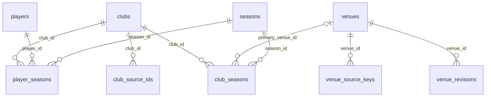
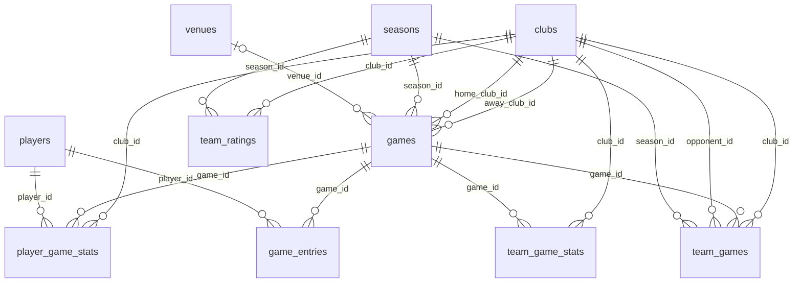
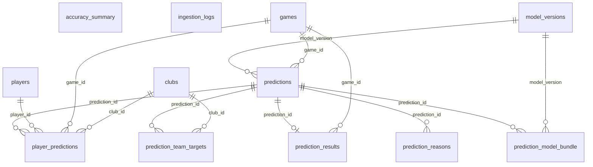

# B.PREDICT データベース現状

| 項目 | 内容 |
|---|---|
| 生成 | **`python3 scripts/describe_schema.py` が生成する。手で編集しない** |
| 生成日 | 2026-10-01 |
| 構造の出典 | `db/migrations/*.sql`（列の説明は DDL のコメント） |
| 行数の出典 | D1 の本番データ（2026-10-01 の `wrangler d1 export`） |
| 定義と設計の理由 | **`docs/design-detail.md` 1章**。この文書では繰り返さない |

この文書は「**いま実際に何が入っているか**」だけを扱う。列の意味・制約の理由・
トリガの設計意図は詳細設計1章にあり、ここに二重に書かない。

## 表の一覧

| 表 | 分類 | 列数 | 行数 | 役割 |
|---|---|---:|---:|---|
| [`accuracy_summary`](#accuracy_summary) | 評価 | 9 | 0 | 的中率の集計層。日次で洗い替える（公開APIが3表の全件走査をしないため） |
| [`club_seasons`](#club_seasons) | マスタ | 8 | 238 | シーズンごとのクラブ断面。名称・リーグ・本拠は年度で変わる。**backfill が試合データから作る** |
| [`club_source_ids`](#club_source_ids) | マスタ | 5 | 30 | 公式サイトのチームIDを `club_id` に解決する対応表。旧B1と新リーグをまたいで名寄せする |
| [`clubs`](#clubs) | マスタ | 5 | 30 | 恒久的なクラブ。改称・リーグ移動があっても不変。表示名は `club_seasons` が持つ |
| [`game_entries`](#game_entries) | ファクト | 6 | 0 | 試合ごとの出場登録。**取得のたびに全行を洗い替える**（推定行が残ると「暫定」が解除されない） |
| [`games`](#games) | ファクト | 25 | 6,270 | 試合。主キーは公式試合ID（自然キーにしない — 延期で日付が変わると別レコードになる） |
| [`ingestion_logs`](#ingestion_logs) | 運用 | 9 | 25 | ジョブの実行履歴。**例外オブジェクトをそのまま入れない**（型名と自前の短いメッセージに限る） |
| [`model_versions`](#model_versions) | 評価（モデル） | 25 | 0 | 学習済みモデル。artifact をテキストで格納する（1.5MB 上限）。有効なものは種別ごとに常に1本 |
| [`player_game_stats`](#player_game_stats) | ファクト | 24 | 146,463 | 選手別のボックススコア。`fgm` / `fga` / `reb` は持たず導出する（冗長列は不整合の余地になる） |
| [`player_predictions`](#player_predictions) | 予測 | 31 | 0 | 選手単位の予測。**チーム予測へ整合化した後の値**を入れる。成功数と得点は導出するため列を持たない |
| [`player_seasons`](#player_seasons) | マスタ | 8 | 0 | 選手の所属断面。シーズン途中の移籍にも対応する |
| [`players`](#players) | マスタ | 5 | 1,024 | 恒久的な選手の人物マスタ。所属は持たない（`player_seasons` と実績側が持つ） |
| [`prediction_model_bundle`](#prediction_model_bundle) | 予測 | 4 | 0 | その予測に使ったモデル一式。1本の予測は最大33本のモデルの合成である |
| [`prediction_reasons`](#prediction_reasons) | 予測 | 8 | 0 | 判断根拠。個別特徴ではなく**要因グループ**に集約した SHAP 値を持つ |
| [`prediction_results`](#prediction_results) | 評価 | 14 | 0 | 確定予測と実績の照合結果。**中止・延期は `VOID` として的中率の母数から外す** |
| [`prediction_team_targets`](#prediction_team_targets) | 予測 | 17 | 0 | 整合化の目標値。**試投数と成功率の組**で持ち、`成功数 ≤ 試投数` を構造的に保証する |
| [`predictions`](#predictions) | 予測 | 19 | 0 | 試合単位の予測。**追記のみ**で、再推論は旧行を `is_active = 0` にして新しい行を足す |
| [`seasons`](#seasons) | マスタ | 5 | 11 | シーズン。`id` にリーグを含める（同一シーズンの PREMIER と ONE を同時に持てるようにする） |
| [`team_game_stats`](#team_game_stats) | ファクト | 22 | 12,540 | チームのボックススコア。選手側と同じ粒度で持つ（整合化の基準になる） |
| [`team_games`](#team_games) | ファクト | 10 | 12,540 | チーム視点の試合行。`games` への OR 条件つき JOIN を消すためにある。日程系の特徴量はここだけを読む |
| [`team_ratings`](#team_ratings) | 派生 | 8 | 0 | 試合日ごとの Elo ほかのスナップショット。**1行はその試合日の終了時点の値である** |
| [`venue_revisions`](#venue_revisions) | マスタ | 5 | 0 | 会場の改称と収容人数の履歴。過去試合は当時の値で表示する。**全期間を再計算して洗い替える派生** |
| [`venue_source_keys`](#venue_source_keys) | マスタ | 2 | 149 | 公式の会場ID（`StadiumCD`）を `venue_id` に解決する対応表 |
| [`venues`](#venues) | マスタ | 7 | 149 | 恒久的な会場。`id` は公式サイトの `StadiumCD`。`name` は初出の名称で固定する |

**12 表にデータがあり、12 表が空である。**

### 空の表とその理由

| 表 | 理由 |
|---|---|
| `accuracy_summary` | `prediction_results` を畳んだ表。照合が始まってから（工程9b 以降） |
| `game_entries` | 取得するのは `gameday_update` で、まだ実装されていない（詳細設計 4.1） |
| `model_versions` | 学習済みモデルの登録は工程8 |
| `player_predictions` | 親の `predictions` が空（工程9b） |
| `player_seasons` | 登録区分とポジションの正規化が未決のため backfill が作らない（詳細設計 3.4） |
| `prediction_model_bundle` | 親の `predictions` が空（工程9b） |
| `prediction_reasons` | 親の `predictions` が空（工程9b） |
| `prediction_results` | 照合は予測が入ってから（工程9b 以降） |
| `prediction_team_targets` | 親の `predictions` が空（工程9b） |
| `predictions` | 推論の結線は工程9b（詳細設計 9章） |
| `team_ratings` | **スナップショット側には 12,532 行ある。** D1 への書き戻しが未実施（詳細設計 4.1 の `rebuild-derived`） |
| `venue_revisions` | **スナップショット側には 173 区間ある。** D1 への書き戻しが未実施（同上の `rebuild-derived`） |

## 関連（ER図）

**手で描かない。** 図は `db/migrations/*.sql` の FK 定義そのものである。
多重度も DDL から導く — 親側は子の FK 列が NOT NULL なら `||`、NULL 可なら `|o`。
子側は FK 列が子の主キーそのものなら `||`（1:1）、そうでなければ `o{`。

**24表を1枚にしない。** 分類ごとに3枚へ分け、各図はその群の子テーブルと
その親（別の群にあっても）を含む。したがって図をまたいで同じ表が現れる。

### マスタ

恒久エンティティ（`clubs` / `players` / `venues` / `seasons`）と、年度断面・履歴・名寄せ。**時間で変わるものを単一行の属性として持たない**

### ファクトと派生

試合ごとに増える表と、バッチが全期間を再計算する派生表。`team_games` は `games` への JOIN を消すためにある

**自己参照**（図には入れていない）

| 表 | 列 | 参照先 |
|---|---|---|
| `games` | `rescheduled_to` | `games.id` |

### 予測と評価

予測は**追記のみ**で、`is_final = 1` の行とその子は凍結される（詳細設計 1.8）

## 表ごとの列

### accuracy_summary

評価 ／ `db/migrations/0006_*.sql` ／ **0 行**

的中率の集計層。日次で洗い替える（公開APIが3表の全件走査をしないため）

> `prediction_results` を畳んだ表。照合が始まってから（工程9b 以降）

| 列 | 型 | NULL | 既定値 | 値あり | 説明 |
|---|---|---|---|---:|---|
| `scope` 🔑 | TEXT | 不可 | — | — | 集計の単位 許容値: `OVERALL` / `SEASON` / `MODEL` / `BUCKET` / `PROVISIONAL` |
| `scope_key` 🔑 | TEXT | 不可 | — | — | その単位の中の鍵（シーズンID・確率帯など） |
| `model_version` 🔑 | TEXT | 不可 | `''` | — | モデル横断の集計では空文字。NULL にしない |
| `n` | INTEGER | 不可 | — | — | 母数（試合数） |
| `accuracy` | REAL | 不可 | — | — | 的中率。**画面では必ず母数を併記する** |
| `brier` | REAL | 不可 | — | — | Brier Score。**主要な改善指標**（0に近いほど良い） |
| `actual_rate` | REAL | 可 | — | — | calibration 用 |
| `baseline_accuracy` | REAL | 可 | — | — | 比較対象（ホーム必勝）の的中率 |
| `updated_at` | TEXT | 不可 | `datetime('now')` | — | **値が変わった時刻**（`fetched_at` は取得時刻であって更新時刻ではない） |

### club_seasons

マスタ ／ `db/migrations/0001_*.sql` ／ **238 行**

シーズンごとのクラブ断面。名称・リーグ・本拠は年度で変わる。**backfill が試合データから作る**

| 列 | 型 | NULL | 既定値 | 値あり | 説明 |
|---|---|---|---|---:|---|
| `club_id` 🔑 | TEXT | 不可 | — | 100% | `clubs.id` への参照 |
| `season_id` 🔑 | TEXT | 不可 | — | 100% | `seasons.id` への参照 |
| `name` | TEXT | 不可 | — | 100% | その年度の正式名称。出典はボックススコアの `TeamNameJ`（当時の名称が入る） |
| `short_name` | TEXT | 不可 | — | 100% | 短縮表記。出典は試合一覧のクラブ選択肢 |
| `league` | TEXT | 不可 | — | 100% | リーグ区分 許容値: `B1` / `B2` / `B3` / `PREMIER` / `ONE` / `NEXT` |
| `primary_venue_id` | TEXT | 可 | — | **0%** | `venues.id` への参照 |
| `color_primary` | TEXT | 可 | — | **0%** | クラブカラー。**公式のロゴ・エンブレムは使わない** |
| `color_secondary` | TEXT | 可 | — | **0%** | 同上 |

### club_source_ids

マスタ ／ `db/migrations/0001_*.sql` ／ **30 行**

公式サイトのチームIDを `club_id` に解決する対応表。旧B1と新リーグをまたいで名寄せする

| 列 | 型 | NULL | 既定値 | 値あり | 説明 |
|---|---|---|---|---:|---|
| `source_id` 🔑 | TEXT | 不可 | — | 100% | 公式サイトのチームID |
| `club_id` | TEXT | 不可 | — | 100% | `clubs.id` への参照 |
| `valid_from` | TEXT | 不可 | — | 100% | この行が有効になる日 |
| `valid_to` | TEXT | 不可 | `'9999-12-31'` | 100% | この行が有効な最後の日（終端は `9999-12-31`） |
| `note` | TEXT | 可 | — | 100% | 名寄せの根拠を残す欄 |

### clubs

マスタ ／ `db/migrations/0001_*.sql` ／ **30 行**

恒久的なクラブ。改称・リーグ移動があっても不変。表示名は `club_seasons` が持つ

| 列 | 型 | NULL | 既定値 | 値あり | 説明 |
|---|---|---|---|---:|---|
| `id` 🔑 | TEXT | 不可 | — | 100% | 公式サイトのチームID。**シーズン・改称・リーグ再編をまたいで不変** |
| `slug` | TEXT | 不可 | — | 100% | `/teams/[slug]` の識別子。**手で決め、改称でも変えない** |
| `name` | TEXT | 不可 | — | 100% | 現在の表示名 |
| `created_at` | TEXT | 不可 | `datetime('now')` | 100% | 行を作った時刻 |
| `updated_at` | TEXT | 不可 | `datetime('now')` | 100% | **値が変わった時刻**（`fetched_at` は取得時刻であって更新時刻ではない） |

### game_entries

ファクト ／ `db/migrations/0002_*.sql` ／ **0 行**

試合ごとの出場登録。**取得のたびに全行を洗い替える**（推定行が残ると「暫定」が解除されない）

> 取得するのは `gameday_update` で、まだ実装されていない（詳細設計 4.1）

| 列 | 型 | NULL | 既定値 | 値あり | 説明 |
|---|---|---|---|---:|---|
| `game_id` 🔑 | TEXT | 不可 | — | — | `games.id` への参照 |
| `player_id` 🔑 | TEXT | 不可 | — | — | `players.id` への参照 |
| `status` | TEXT | 不可 | — | — | 試合の状態 許容値: `ENTRY` / `OUT` / `UNKNOWN` |
| `source` | TEXT | 不可 | — | — | 公式確定か推定か。**`ESTIMATED` が1件でも残る試合は「暫定」** 許容値: `OFFICIAL` / `ESTIMATED` |
| `confidence` | REAL | 可 | — | — | 推定の確度（公式確定なら使わない） 値域: `0`〜`1` |
| `fetched_at` | TEXT | 不可 | — | — | 取得した時刻 |

### games

ファクト ／ `db/migrations/0002_*.sql` ／ **6,270 行**

試合。主キーは公式試合ID（自然キーにしない — 延期で日付が変わると別レコードになる）

| 列 | 型 | NULL | 既定値 | 値あり | 説明 |
|---|---|---|---|---:|---|
| `id` 🔑 | TEXT | 不可 | — | 100% | 公式サイトの試合ID |
| `season_id` | TEXT | 不可 | — | 100% | `seasons.id` への参照 |
| `league` | TEXT | 不可 | — | 100% | API応答と一致させるため非正規化 |
| `competition` | TEXT | 不可 | — | 100% | REGULAR = リーグ戦 / PLAYOFF = チャンピオンシップ 許容値: `REGULAR` / `PLAYOFF` |
| `game_date` | TEXT | 不可 | — | 100% | 変更されうる属性 |
| `tipoff_at` | TEXT | 不可 | — | 100% | 試合開始時刻（UTC）。特徴量の `as_of` はこの値である |
| `finished_at` | TEXT | 可 | — | 100% | 試合終了時刻。リーク判定の絞り込みはこの列で行う |
| `finished_at_is_estimated` | INTEGER | 不可 | `0` | 100% | 1 なら `finished_at` が実測ではなく `tipoff_at + 2時間` の推定値 許容値: `0` / `1` |
| `home_club_id` | TEXT | 不可 | — | 100% | ホームのクラブ |
| `away_club_id` | TEXT | 不可 | — | 100% | アウェイのクラブ |
| `venue_id` | TEXT | 可 | — | 100% | `venues.id` への参照 |
| `venue_name_at_game` | TEXT | 可 | — | 100% | その試合時点の会場名（StadiumNameJ）。 venue_revisions.name の唯一の入力（1.2） |
| `is_primary_venue` | INTEGER | 不可 | `1` | 100% | メイン会場か（代替会場ではホームアドバンテージが下がる） 許容値: `0` / `1` |
| `series_game_no` | INTEGER | 可 | — | 100% | 同一カード連戦の何戦目か。**Bリーグは土日2連戦が基本編成である** |
| `status` | TEXT | 不可 | — | 100% | 試合の状態 許容値: `SCHEDULED` / `FINISHED` / `POSTPONED` / `CANCELLED` |
| `rescheduled_to` | TEXT | 可 | — | **0%** | 延期先。旧行は POSTPONED で残す |
| `home_score` | INTEGER | 可 | — | 100% | ホームの得点（終了後に入る） |
| `away_score` | INTEGER | 可 | — | 100% | アウェイの得点（終了後に入る） |
| `attendance` | INTEGER | 可 | — | 100% | 入場者数 |
| `spectator_restricted` | INTEGER | 可 | — | 19% | NULL = 判定不能（attendance か capacity が欠損） |
| `result_revision` | INTEGER | 不可 | `0` | 100% | スコア訂正のたびに +1 |
| `source_url` | TEXT | 可 | — | 100% | 取得元のページ。**公開APIのレスポンスには含めない** |
| `fetched_at` | TEXT | 可 | — | 100% | 取得した時刻 |
| `created_at` | TEXT | 不可 | `datetime('now')` | 100% | 行を作った時刻 |
| `updated_at` | TEXT | 不可 | `datetime('now')` | 100% | **値が変わった時刻**（`fetched_at` は取得時刻であって更新時刻ではない） |

### ingestion_logs

運用 ／ `db/migrations/0007_*.sql` ／ **25 行**

ジョブの実行履歴。**例外オブジェクトをそのまま入れない**（型名と自前の短いメッセージに限る）

| 列 | 型 | NULL | 既定値 | 値あり | 説明 |
|---|---|---|---|---:|---|
| `id` 🔑 | TEXT | 不可 | — | 100% | 実行の識別子 |
| `job` | TEXT | 不可 | — | 100% | ジョブ名 |
| `started_at` | TEXT | 不可 | — | 100% | 開始時刻 |
| `finished_at` | TEXT | 可 | — | 100% | 試合終了時刻。**リーク判定の絞り込みはこの列で行う**（`tipoff_at` ではない） |
| `status` | TEXT | 不可 | — | 100% | 試合の状態 許容値: `RUNNING` / `SUCCESS` / `PARTIAL` / `FAILED` / `ABORTED` |
| `rows_affected` | INTEGER | 可 | — | 100% | 書き込んだ行数（無料枠の監視に使う） |
| `d1_rows_read` | INTEGER | 可 | — | **0%** | 無料枠の監視用 |
| `error_type` | TEXT | 可 | — | **0%** | 例外の型名のみ |
| `error_message` | TEXT | 可 | — | **0%** | 自前の短いメッセージのみ |

### model_versions

評価（モデル） ／ `db/migrations/0004_*.sql` ／ **0 行**

学習済みモデル。artifact をテキストで格納する（1.5MB 上限）。有効なものは種別ごとに常に1本

> 学習済みモデルの登録は工程8

| 列 | 型 | NULL | 既定値 | 値あり | 説明 |
|---|---|---|---|---:|---|
| `version` 🔑 | TEXT | 不可 | — | — | 'winner-v1.0.0' |
| `model_type` | TEXT | 不可 | — | — | モデルの種別 許容値: `WINNER` / `MARGIN` / `TOTAL` / `TEAM_RATE` / `PLAYER_AVAIL` / `PLAYER_MIN` / `PLAYER_RATE` |
| `target` | TEXT | 不可 | `''` | — | *_RATE のみ: 'fg2a'|'fg2_pct'|... の14種 |
| `league` | TEXT | 不可 | `'PREMIER'` | — | リーグ区分 |
| `win_prob_source` | TEXT | 可 | — | — | WINNER/MARGIN のみ。採用した勝率導出経路 許容値: `WINNER` / `MARGIN` |
| `margin_sigma` | REAL | 可 | — | — | MARGIN のみ。P(home)=Φ(margin/σ) の σ |
| `algo` | TEXT | 不可 | — | — | アルゴリズム |
| `trained_at` | TEXT | 不可 | — | — | 学習した時刻 |
| `train_rows` | INTEGER | 不可 | — | — | 学習に使った行数 |
| `train_range` | TEXT | 不可 | — | — | 学習データの範囲 |
| `eval_window` | TEXT | 不可 | — | — | 比較の公平性のため固定した評価対象 |
| `params` | TEXT | 不可 | — | — | JSON。seed 系を必ず含める |
| `feature_list` | TEXT | 不可 | — | — | JSON配列 |
| `feature_null_rates` | TEXT | 可 | — | — | JSON。欠損率30%超の検出用 |
| `cv_accuracy` | REAL | 可 | — | — | walk-forward の Accuracy。**表示専用で、採用判定には使わない** |
| `cv_brier` | REAL | 可 | — | — | walk-forward の Brier。**ただし採用判定では同一ウィンドウで再評価した値を使う** |
| `cv_logloss` | REAL | 可 | — | — | walk-forward の Log Loss（学習時の目的関数） |
| `cv_ece` | REAL | 可 | — | — | 等頻度10ビン |
| `baseline_home_accuracy` | REAL | 可 | — | — | 「ホームが必ず勝つ」の Accuracy（実測 52.7%） |
| `baseline_elo_brier` | REAL | 可 | — | — | Elo単体ロジスティック回帰 |
| `artifact_text` | TEXT | 可 | — | — | LightGBM の save_model() 出力 |
| `artifact_sha256` | TEXT | 可 | — | — | artifact のハッシュ。取得後に照合する |
| `calibrator` | TEXT | 可 | — | — | 較正器のパラメータ。使う場合のみ |
| `is_active` | INTEGER | 不可 | `0` | — | いま有効な世代か。1試合につき常に1本 許容値: `0` / `1` |
| `notes` | TEXT | 可 | — | — | 備考 |

### player_game_stats

ファクト ／ `db/migrations/0002_*.sql` ／ **146,463 行**

選手別のボックススコア。`fgm` / `fga` / `reb` は持たず導出する（冗長列は不整合の余地になる）

| 列 | 型 | NULL | 既定値 | 値あり | 説明 |
|---|---|---|---|---:|---|
| `game_id` 🔑 | TEXT | 不可 | — | 100% | `games.id` への参照 |
| `player_id` 🔑 | TEXT | 不可 | — | 100% | `players.id` への参照 |
| `club_id` | TEXT | 不可 | — | 100% | `clubs.id` への参照 |
| `game_date` | TEXT | 不可 | — | 100% | その試合の **JST における暦日**（`tipoff_at` を JST へ変換して求める） |
| `started` | INTEGER | 可 | — | 61% | スターターか 許容値: `0` / `1` 取得元: `StartingFlg` |
| `minutes` | REAL | 可 | — | 89% | シュート。2P と 3P を別建てで持ち、FG は導出する 取得元: `PlayTime` |
| `fg2m` | INTEGER | 可 | — | 100% | 2点シュート成功数 取得元: `PT2M` |
| `fg2a` | INTEGER | 可 | — | 100% | 2点シュート試投数 取得元: `PT2A` |
| `fg3m` | INTEGER | 可 | — | 100% | 3点シュート成功数 取得元: `PT3M` |
| `fg3a` | INTEGER | 可 | — | 100% | 3点シュート試投数 取得元: `PT3A` |
| `ftm` | INTEGER | 可 | — | 100% | リバウンド 取得元: `FTM` |
| `fta` | INTEGER | 可 | — | 100% | フリースロー試投数 取得元: `FTA` |
| `oreb` | INTEGER | 可 | — | 100% | プレー 取得元: `RB_OFF` |
| `dreb` | INTEGER | 可 | — | 100% | ディフェンスリバウンド 取得元: `RB_DEF` |
| `ast` | INTEGER | 可 | — | 100% | ファウル 取得元: `AS` |
| `tov` | INTEGER | 可 | — | 100% | ターンオーバー 取得元: `TO` |
| `stl` | INTEGER | 可 | — | 100% | スティール 取得元: `ST` |
| `blk` | INTEGER | 可 | — | 100% | ブロック 取得元: `BS` |
| `pf` | INTEGER | 可 | — | 100% | F  : 自分が犯したファウル 取得元: `FOUL` |
| `fd` | INTEGER | 可 | — | 100% | FD : 被ファウル数 実績としてのみ保持（予測しない） 取得元: `FOULON` |
| `plus_minus` | INTEGER | 可 | — | 49% | ＋/−。**実績としてのみ持ち、予測しない**（1試合の分散が大きく、情報も増えない） 取得元: `PLUSMINUS` |
| `pts` | INTEGER | 可 | — | 100% | 取得値。恒等式の検証に使う 取得元: `Point` |
| `fetched_at` | TEXT | 不可 | — | 100% | 取得した時刻 |
| `updated_at` | TEXT | 不可 | `datetime('now')` | 100% | **値が変わった時刻**（`fetched_at` は取得時刻であって更新時刻ではない） |

### player_predictions

予測 ／ `db/migrations/0005_*.sql` ／ **0 行**

選手単位の予測。**チーム予測へ整合化した後の値**を入れる。成功数と得点は導出するため列を持たない

> 親の `predictions` が空（工程9b）

| 列 | 型 | NULL | 既定値 | 値あり | 説明 |
|---|---|---|---|---:|---|
| `id` 🔑 | TEXT | 不可 | — | — | 予測の識別子 |
| `prediction_id` | TEXT | 不可 | — | — | 親の世代に紐付ける |
| `game_id` | TEXT | 不可 | — | — | `games.id` への参照 |
| `player_id` | TEXT | 不可 | — | — | `players.id` への参照 |
| `club_id` | TEXT | 不可 | — | — | `clubs.id` への参照 |
| `model_version` | TEXT | 不可 | — | — | 使ったモデルのバージョン |
| `revision` | INTEGER | 不可 | — | — | 同一試合・同一モデルの推論回数（世代通番） |
| `predicted_at` | TEXT | 不可 | — | — | 推論した時刻 |
| `avail_prob` | REAL | 不可 | — | — | 出場確率。**0.5 未満の選手は画面に出さない** 値域: `0`〜`1` |
| `pred_minutes` | REAL | 不可 | — | — | 整合化後の期待出場時間 |
| `pred_fg2a` | REAL | 不可 | — | — | 予測値: 2点シュート試投数 |
| `pred_fg3a` | REAL | 不可 | — | — | 予測値: 3点シュート試投数 |
| `pred_fta` | REAL | 不可 | — | — | 予測値: フリースロー試投数 |
| `pred_fg2_pct` | REAL | 不可 | — | — | 予測値: 2点シュートの成功率 値域: `0`〜`1` |
| `pred_fg3_pct` | REAL | 不可 | — | — | 予測値: 3点シュートの成功率 値域: `0`〜`1` |
| `pred_ft_pct` | REAL | 不可 | — | — | 予測値: フリースローの成功率 値域: `0`〜`1` |
| `pred_oreb` | REAL | 不可 | — | — | 予測値: オフェンスリバウンド |
| `pred_dreb` | REAL | 不可 | — | — | 予測値: ディフェンスリバウンド |
| `pred_ast` | REAL | 不可 | — | — | 予測値: アシスト |
| `pred_tov` | REAL | 不可 | — | — | 予測値: ターンオーバー |
| `pred_stl` | REAL | 不可 | — | — | 予測値: スティール |
| `pred_blk` | REAL | 不可 | — | — | 予測値: ブロック |
| `pred_pf` | REAL | 不可 | — | — | 予測値: 自分が犯したファウル数 |
| `pred_fd` | REAL | 不可 | — | — | 予測値: 被ファウル数（FIBA 系の `FD`。NBA の「テイクチャージ」に相当する） |
| `err_minutes` | REAL | 可 | — | — | 誤差の目安（当該選手の直近N試合の絶対誤差の中央値）。主要4項目のみ持つ |
| `err_pts` | REAL | 可 | — | — | 同 得点 |
| `err_reb` | REAL | 可 | — | — | 同 リバウンド |
| `err_ast` | REAL | 可 | — | — | 同 アシスト |
| `is_provisional` | INTEGER | 不可 | `1` | — | 出場者未確定のまま算出した予測か（画面の「暫定」） |
| `is_final` | INTEGER | 不可 | `0` | — | 試合開始をもって凍結された予測か。**1 の行は更新・削除できない** |
| `is_active` | INTEGER | 不可 | `1` | — | いま有効な世代か。1試合につき常に1本 |

### player_seasons

マスタ ／ `db/migrations/0001_*.sql` ／ **0 行**

選手の所属断面。シーズン途中の移籍にも対応する

> 登録区分とポジションの正規化が未決のため backfill が作らない（詳細設計 3.4）

| 列 | 型 | NULL | 既定値 | 値あり | 説明 |
|---|---|---|---|---:|---|
| `player_id` 🔑 | TEXT | 不可 | — | — | `players.id` への参照 |
| `season_id` 🔑 | TEXT | 不可 | — | — | `seasons.id` への参照 |
| `club_id` 🔑 | TEXT | 不可 | — | — | `clubs.id` への参照 |
| `number` | TEXT | 可 | — | — | 背番号 |
| `position` | TEXT | 可 | — | — | ポジション 許容値: `PG` / `SG` / `SF` / `PF` / `C` |
| `roster_type` | TEXT | 可 | — | — | 登録区分 許容値: `JP` / `NATURALIZED` / `ASIA` / `FOREIGN` |
| `joined_on` | TEXT | 可 | — | — | 加入日 |
| `left_on` | TEXT | 可 | — | — | 退団日 |

### players

マスタ ／ `db/migrations/0001_*.sql` ／ **1,024 行**

恒久的な選手の人物マスタ。所属は持たない（`player_seasons` と実績側が持つ）

| 列 | 型 | NULL | 既定値 | 値あり | 説明 |
|---|---|---|---|---:|---|
| `id` 🔑 | TEXT | 不可 | — | 100% | 公式サイトの選手ID |
| `name` | TEXT | 不可 | — | 100% | 氏名 |
| `height_cm` | INTEGER | 可 | — | **0%** | 身長（cm） |
| `created_at` | TEXT | 不可 | `datetime('now')` | 100% | 行を作った時刻 |
| `updated_at` | TEXT | 不可 | `datetime('now')` | 100% | **値が変わった時刻**（`fetched_at` は取得時刻であって更新時刻ではない） |

### prediction_model_bundle

予測 ／ `db/migrations/0005_*.sql` ／ **0 行**

その予測に使ったモデル一式。1本の予測は最大33本のモデルの合成である

> 親の `predictions` が空（工程9b）

| 列 | 型 | NULL | 既定値 | 値あり | 説明 |
|---|---|---|---|---:|---|
| `prediction_id` 🔑 | TEXT | 不可 | — | — | `predictions.id` への参照 |
| `model_type` 🔑 | TEXT | 不可 | — | — | モデルの種別 |
| `target` 🔑 | TEXT | 不可 | `''` | — | `*_RATE` のときの対象項目（14種） |
| `model_version` | TEXT | 不可 | — | — | 使ったモデルのバージョン |

### prediction_reasons

予測 ／ `db/migrations/0005_*.sql` ／ **0 行**

判断根拠。個別特徴ではなく**要因グループ**に集約した SHAP 値を持つ

> 親の `predictions` が空（工程9b）

| 列 | 型 | NULL | 既定値 | 値あり | 説明 |
|---|---|---|---|---:|---|
| `prediction_id` 🔑 | TEXT | 不可 | — | — | `predictions.id` への参照 |
| `rank` 🔑 | INTEGER | 不可 | — | — | 表示順 |
| `group_key` | TEXT | 不可 | — | — | 'TEAM_STRENGTH'|'SCHEDULE'|'PLAYER'|'VENUE' |
| `label_ja` | TEXT | 不可 | — | — | 画面に出すラベル。**選手個人の能力・資質への評価を含む表現を使わない** |
| `value_text` | TEXT | 不可 | — | — | 画面に出す値の文言 |
| `favors` | TEXT | 不可 | — | — | 有利な側 許容値: `HOME` / `AWAY` |
| `contribution` | REAL | 不可 | — | — | グループ集約したSHAP値（ログオッズ空間） |
| `base_value` | REAL | 不可 | — | — | explainer の期待値。事後検証用 |

### prediction_results

評価 ／ `db/migrations/0006_*.sql` ／ **0 行**

確定予測と実績の照合結果。**中止・延期は `VOID` として的中率の母数から外す**

> 照合は予測が入ってから（工程9b 以降）

| 列 | 型 | NULL | 既定値 | 値あり | 説明 |
|---|---|---|---|---:|---|
| `prediction_id` 🔑 | TEXT | 不可 | — | — | `predictions.id` への参照 |
| `game_id` | TEXT | 不可 | — | — | `games.id` への参照 |
| `season_id` | TEXT | 不可 | — | — | 非正規化 |
| `model_version` | TEXT | 不可 | — | — | 使ったモデルのバージョン |
| `home_win_prob` | REAL | 不可 | — | — | 非正規化。calibration 用 |
| `prob_bucket` | INTEGER | 不可 | — | — | 0-9。GROUP BY 用 |
| `outcome` | TEXT | 不可 | — | — | 照合の結果 許容値: `WIN` / `LOSS` / `VOID` |
| `predicted_home_win` | INTEGER | 可 | — | — | ホーム勝利と予想したか |
| `actual_home_win` | INTEGER | 可 | — | — | VOID のとき NULL |
| `is_correct` | INTEGER | 可 | — | — | 的中したか |
| `brier` | REAL | 可 | — | — | Brier Score。**主要な改善指標**（0に近いほど良い） |
| `score_mae` | REAL | 可 | — | — | 予想スコアの絶対誤差 |
| `was_provisional` | INTEGER | 不可 | — | — | 暫定の段階で出した予測だったか（暫定/確定の内訳に使う） |
| `evaluated_at` | TEXT | 不可 | `datetime('now')` | — | 照合した時刻 |

### prediction_team_targets

予測 ／ `db/migrations/0005_*.sql` ／ **0 行**

整合化の目標値。**試投数と成功率の組**で持ち、`成功数 ≤ 試投数` を構造的に保証する

> 親の `predictions` が空（工程9b）

| 列 | 型 | NULL | 既定値 | 値あり | 説明 |
|---|---|---|---|---:|---|
| `prediction_id` 🔑 | TEXT | 不可 | — | — | `predictions.id` への参照 |
| `club_id` 🔑 | TEXT | 不可 | — | — | `clubs.id` への参照 |
| `is_home` | INTEGER | 不可 | — | — | ホーム側か 許容値: `0` / `1` |
| `tgt_fg2a` | REAL | 不可 | — | — | チーム目標: 2点シュート試投数 |
| `tgt_fg3a` | REAL | 不可 | — | — | チーム目標: 3点シュート試投数 |
| `tgt_fta` | REAL | 不可 | — | — | チーム目標: フリースロー試投数 |
| `tgt_fg2_pct` | REAL | 不可 | — | — | チーム目標: 2点シュートの成功率 値域: `0`〜`1` |
| `tgt_fg3_pct` | REAL | 不可 | — | — | チーム目標: 3点シュートの成功率 値域: `0`〜`1` |
| `tgt_ft_pct` | REAL | 不可 | — | — | チーム目標: フリースローの成功率 値域: `0`〜`1` |
| `tgt_oreb` | REAL | 不可 | — | — | チーム目標: オフェンスリバウンド |
| `tgt_dreb` | REAL | 不可 | — | — | チーム目標: ディフェンスリバウンド |
| `tgt_ast` | REAL | 不可 | — | — | チーム目標: アシスト |
| `tgt_tov` | REAL | 不可 | — | — | チーム目標: ターンオーバー |
| `tgt_stl` | REAL | 不可 | — | — | チーム目標: スティール |
| `tgt_blk` | REAL | 不可 | — | — | チーム目標: ブロック |
| `tgt_pf` | REAL | 不可 | — | — | チーム目標: 自分が犯したファウル数 |
| `tgt_fd` | REAL | 不可 | — | — | チーム目標: 被ファウル数（FIBA 系の `FD`。NBA の「テイクチャージ」に相当する） |

### predictions

予測 ／ `db/migrations/0005_*.sql` ／ **0 行**

試合単位の予測。**追記のみ**で、再推論は旧行を `is_active = 0` にして新しい行を足す

> 推論の結線は工程9b（詳細設計 9章）

| 列 | 型 | NULL | 既定値 | 値あり | 説明 |
|---|---|---|---|---:|---|
| `id` 🔑 | TEXT | 不可 | — | — | 予測の識別子 |
| `game_id` | TEXT | 不可 | — | — | `games.id` への参照 |
| `season_id` | TEXT | 不可 | — | — | accuracy 集計用に非正規化 |
| `model_version` | TEXT | 不可 | — | — | 使ったモデルのバージョン |
| `revision` | INTEGER | 不可 | — | — | 世代通番 1,2,3... |
| `run_id` | TEXT | 不可 | — | — | ingestion_logs.id |
| `predicted_at` | TEXT | 不可 | — | — | 推論した時刻 |
| `as_of` | TEXT | 不可 | — | — | 特徴量が参照してよい上限時刻 |
| `data_as_of` | TEXT | 不可 | — | — | 実行時点でDBにあった最新試合の終了時刻 |
| `home_win_prob` | REAL | 不可 | — | — | ホームの勝率。アウェイは `1 - この値`（冗長列を持たない） 値域: `0`〜`1` |
| `pred_margin` | REAL | 可 | — | — | 予想得点差（ホーム − アウェイ） |
| `pred_total` | REAL | 可 | — | — | 予想合計得点 |
| `pred_home_score` | REAL | 可 | — | — | 予想得点。`(total + margin) / 2` で導出する（独立に回帰しない） |
| `pred_away_score` | REAL | 可 | — | — | 同 `(total - margin) / 2` |
| `is_provisional` | INTEGER | 不可 | `1` | — | 出場者未確定のまま算出した予測か（画面の「暫定」） 許容値: `0` / `1` |
| `is_final` | INTEGER | 不可 | `0` | — | 試合開始をもって凍結された予測か。**1 の行は更新・削除できない** 許容値: `0` / `1` |
| `is_active` | INTEGER | 不可 | `1` | — | いま有効な世代か。1試合につき常に1本 許容値: `0` / `1` |
| `feature_snapshot` | TEXT | 不可 | — | — | JSON |
| `created_at` | TEXT | 不可 | `datetime('now')` | — | 行を作った時刻 |

### seasons

マスタ ／ `db/migrations/0001_*.sql` ／ **11 行**

シーズン。`id` にリーグを含める（同一シーズンの PREMIER と ONE を同時に持てるようにする）

| 列 | 型 | NULL | 既定値 | 値あり | 説明 |
|---|---|---|---|---:|---|
| `id` 🔑 | TEXT | 不可 | — | 100% | '2026-27-PREMIER' |
| `label` | TEXT | 不可 | — | 100% | '2026-27' |
| `league` | TEXT | 不可 | — | 100% | リーグ区分 許容値: `B1` / `B2` / `B3` / `PREMIER` / `ONE` / `NEXT` |
| `start_date` | TEXT | 不可 | — | 100% | 当季の **9月1日**。取り込む試合日の上位集合であればよく、**狭いと実在する試合日が404になる** |
| `end_date` | TEXT | 不可 | — | 100% | 翌年の **6月30日**。同上 |

### team_game_stats

ファクト ／ `db/migrations/0002_*.sql` ／ **12,540 行**

チームのボックススコア。選手側と同じ粒度で持つ（整合化の基準になる）

| 列 | 型 | NULL | 既定値 | 値あり | 説明 |
|---|---|---|---|---:|---|
| `game_id` 🔑 | TEXT | 不可 | — | 100% | `games.id` への参照 |
| `club_id` 🔑 | TEXT | 不可 | — | 100% | `clubs.id` への参照 |
| `game_date` | TEXT | 不可 | — | 100% | JOIN とソートを消すための非正規化 |
| `is_home` | INTEGER | 不可 | — | 100% | ホーム側か 許容値: `0` / `1` |
| `pts` | INTEGER | 可 | — | 100% | 得点。恒等式 `2FGM×2 + 3FGM×3 + FTM` の検証に使う 取得元: `Point` |
| `fg2m` | INTEGER | 可 | — | 100% | 選手側と同じ粒度で持つ（整合化の基準になる） 取得元: `PT2M` |
| `fg2a` | INTEGER | 可 | — | 100% | 2点シュート試投数 取得元: `PT2A` |
| `fg3m` | INTEGER | 可 | — | 100% | 3点シュート成功数 取得元: `PT3M` |
| `fg3a` | INTEGER | 可 | — | 100% | 3点シュート試投数 取得元: `PT3A` |
| `ftm` | INTEGER | 可 | — | 100% | フリースロー成功数 取得元: `FTM` |
| `fta` | INTEGER | 可 | — | 100% | フリースロー試投数 取得元: `FTA` |
| `oreb` | INTEGER | 可 | — | 100% | オフェンスリバウンド 取得元: `RB_OFF` |
| `dreb` | INTEGER | 可 | — | 100% | ディフェンスリバウンド 取得元: `RB_DEF` |
| `ast` | INTEGER | 可 | — | 100% | アシスト 取得元: `AS` |
| `tov` | INTEGER | 可 | — | 100% | ターンオーバー 取得元: `TO` |
| `stl` | INTEGER | 可 | — | 100% | スティール 取得元: `ST` |
| `blk` | INTEGER | 可 | — | 100% | ブロック 取得元: `BS` |
| `pf` | INTEGER | 可 | — | 100% | 自分が犯したファウル数 取得元: `FOUL` |
| `fd` | INTEGER | 可 | — | 100% | 被ファウル数（FIBA 系の `FD`。NBA の「テイクチャージ」に相当する） 取得元: `FOULON` |
| `possessions` | REAL | 可 | — | 100% | ポゼッション（攻撃回数の推定値）。`fga - oreb + tov + 0.44 × fta` |
| `fetched_at` | TEXT | 不可 | — | 100% | 取得した時刻 |
| `updated_at` | TEXT | 不可 | `datetime('now')` | 100% | **値が変わった時刻**（`fetched_at` は取得時刻であって更新時刻ではない） |

### team_games

ファクト ／ `db/migrations/0002_*.sql` ／ **12,540 行**

チーム視点の試合行。`games` への OR 条件つき JOIN を消すためにある。日程系の特徴量はここだけを読む

| 列 | 型 | NULL | 既定値 | 値あり | 説明 |
|---|---|---|---|---:|---|
| `game_id` 🔑 | TEXT | 不可 | — | 100% | `games.id` への参照 |
| `club_id` 🔑 | TEXT | 不可 | — | 100% | `clubs.id` への参照 |
| `opponent_id` | TEXT | 不可 | — | 100% | 対戦相手のクラブ |
| `season_id` | TEXT | 不可 | — | 100% | `seasons.id` への参照 |
| `game_date` 🔑 | TEXT | 不可 | — | 100% | その試合の **JST における暦日**（`tipoff_at` を JST へ変換して求める） |
| `finished_at` | TEXT | 可 | — | 100% | 試合終了時刻。**リーク判定の絞り込みはこの列で行う**（`tipoff_at` ではない） |
| `is_home` | INTEGER | 不可 | — | 100% | ホーム側か 許容値: `0` / `1` |
| `competition` | TEXT | 不可 | — | 100% | 大会区分。取り込むのはこの2区分だけ（オールスター・入替戦・プレシーズンは入れない） 許容値: `REGULAR` / `PLAYOFF` |
| `result` | INTEGER | 可 | — | 100% | NULL = 未実施 許容値: `0` / `1` |
| `margin` | INTEGER | 可 | — | 100% | 得失点差（自チーム − 相手） |

### team_ratings

派生 ／ `db/migrations/0003_*.sql` ／ **0 行**

試合日ごとの Elo ほかのスナップショット。**1行はその試合日の終了時点の値である**

> **スナップショット側には 12,532 行ある。** D1 への書き戻しが未実施（詳細設計 4.1 の `rebuild-derived`）

| 列 | 型 | NULL | 既定値 | 値あり | 説明 |
|---|---|---|---|---:|---|
| `club_id` 🔑 | TEXT | 不可 | — | — | `clubs.id` への参照 |
| `as_of_date` 🔑 | TEXT | 不可 | — | — | その試合日。**値はこの日の終了時点**であり、参照は `as_of_date < 対象試合日` で行う |
| `season_id` | TEXT | 不可 | — | — | `seasons.id` への参照 |
| `elo` | REAL | 不可 | — | — | Elo レーティング。**単一特徴として最も強い** |
| `off_rating` | REAL | 可 | — | — | オフェンスレーティング。**集計窓が未決のため現在は NULL** |
| `def_rating` | REAL | 可 | — | — | ディフェンスレーティング。同上 |
| `pace` | REAL | 可 | — | — | ペース。同上 |
| `games_played` | INTEGER | 不可 | — | — | その時点の消化試合数。10未満は Elo の信頼度が低い |

### venue_revisions

マスタ ／ `db/migrations/0001_*.sql` ／ **0 行**

会場の改称と収容人数の履歴。過去試合は当時の値で表示する。**全期間を再計算して洗い替える派生**

> **スナップショット側には 173 区間ある。** D1 への書き戻しが未実施（同上の `rebuild-derived`）

| 列 | 型 | NULL | 既定値 | 値あり | 説明 |
|---|---|---|---|---:|---|
| `venue_id` 🔑 | TEXT | 不可 | — | — | `venues.id` への参照 |
| `valid_from` 🔑 | TEXT | 不可 | — | — | この行が有効になる日 |
| `valid_to` | TEXT | 不可 | `'9999-12-31'` | — | この行が有効な最後の日（終端は `9999-12-31`） |
| `name` | TEXT | 不可 | — | — | 当時の名称。`games.venue_name_at_game` から全期間を再計算する |
| `capacity` | INTEGER | 可 | — | — | **B.LEAGUE 開催時の観客席数**。公式サイトに無いため手入力（行ごとに出典URL） |

### venue_source_keys

マスタ ／ `db/migrations/0001_*.sql` ／ **149 行**

公式の会場ID（`StadiumCD`）を `venue_id` に解決する対応表

| 列 | 型 | NULL | 既定値 | 値あり | 説明 |
|---|---|---|---|---:|---|
| `source_code` 🔑 | TEXT | 不可 | — | 100% | 公式の会場ID |
| `venue_id` | TEXT | 不可 | — | 100% | `venues.id` への参照 |

### venues

マスタ ／ `db/migrations/0001_*.sql` ／ **149 行**

恒久的な会場。`id` は公式サイトの `StadiumCD`。`name` は初出の名称で固定する

| 列 | 型 | NULL | 既定値 | 値あり | 説明 |
|---|---|---|---|---:|---|
| `id` 🔑 | TEXT | 不可 | — | 100% | 公式サイトの会場ID（`StadiumCD`）。**文字列に正規化して持つ** |
| `name` | TEXT | 不可 | — | 100% | 現在の表示名 |
| `prefecture` | TEXT | 可 | — | **0%** | 都道府県。住所から導く（国土地理院の候補で解決する） |
| `lat` | REAL | 可 | — | **0%** | 緯度。**1回だけ解決して CSV に固定**し、実行時に外部サービスへ依存しない |
| `lng` | REAL | 可 | — | **0%** | 経度。同上 |
| `created_at` | TEXT | 不可 | `datetime('now')` | 100% | 行を作った時刻 |
| `updated_at` | TEXT | 不可 | `datetime('now')` | 100% | **値が変わった時刻**（`fetched_at` は取得時刻であって更新時刻ではない） |

## トリガ

**予測の凍結を守る関門である**（詳細設計 1.8）。`is_final = 1` の行とその子は
更新・削除できない。

| トリガ | 対象の表 |
|---|---|
| `trg_model_artifact_size` | `model_versions` |
| `trg_ppred_final_immutable` | `player_predictions` |
| `trg_ppred_final_nodelete` | `player_predictions` |
| `trg_ppred_parent_final_immutable` | `player_predictions` |
| `trg_ppred_parent_final_nodelete` | `player_predictions` |
| `trg_bundle_final_immutable` | `prediction_model_bundle` |
| `trg_bundle_final_nodelete` | `prediction_model_bundle` |
| `trg_reasons_final_immutable` | `prediction_reasons` |
| `trg_reasons_final_nodelete` | `prediction_reasons` |
| `trg_team_targets_final_immutable` | `prediction_team_targets` |
| `trg_team_targets_final_nodelete` | `prediction_team_targets` |
| `trg_predictions_final_immutable` | `predictions` |
| `trg_predictions_final_nodelete` | `predictions` |
